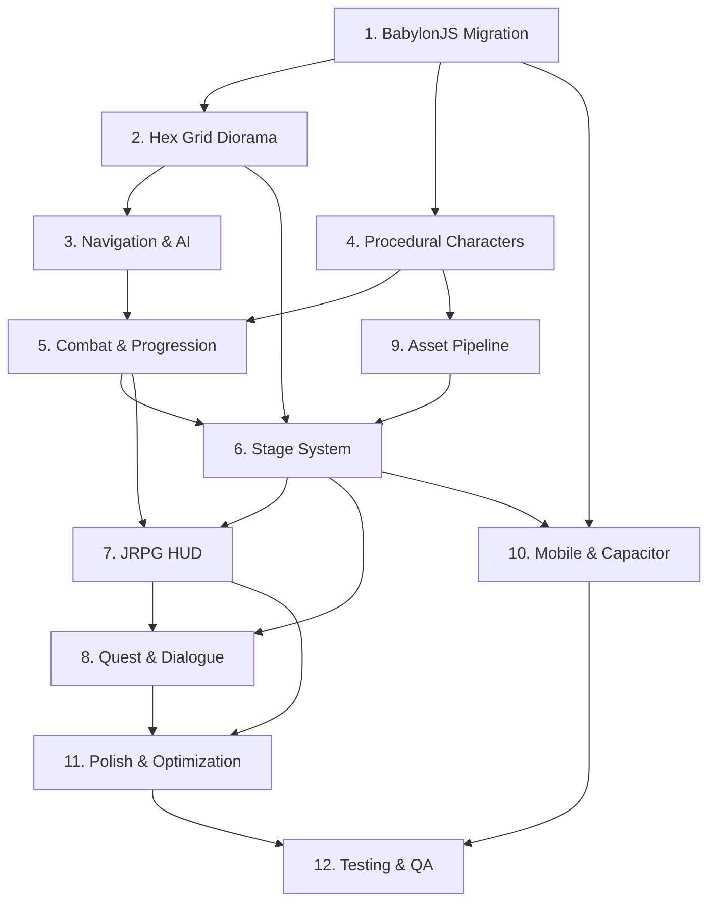

# Implementation Tasks: Neo-Tokyo Rival Academies - Production Launch

## Overview

This implementation plan delivers the complete production-ready game with all 9 stages, comprehensive systems, and mobile deployment. The plan is organized into 12 major sections executed sequentially, with each section containing detailed tasks.

## Version Requirements

- Node.js: >=22.22.0
- PNPM: >=10.0.0
- TypeScript: 5.9+
- React: 19
- BabylonJS: 8.46+
- Reactylon: Latest
- Capacitor: 8.0+

## Task Sections

| Section | File | Tasks | Status |
|---------|------|-------|--------|
| 1. BabylonJS Migration Foundation | [01-babylon-migration.md](tasks/01-babylon-migration.md) | 15 | Not Started |
| 2. Hex Grid Diorama System | [02-hex-grid-diorama.md](tasks/02-hex-grid-diorama.md) | 12 | Not Started |
| 3. Navigation & AI Systems | [03-navigation-ai.md](tasks/03-navigation-ai.md) | 17 | Not Started |
| 4. Combat & Progression Systems | [04-combat-progression.md](tasks/04-combat-progression.md) | 21 | Not Started |
| 5. Quest & Dialogue Systems | [05-quest-dialogue.md](tasks/05-quest-dialogue.md) | 19 | Not Started |
| 6. Stage Content & Narrative | [06-stage-content.md](tasks/06-stage-content.md) | 28 | Not Started |
| 7. Procedural Character Generation | [07-procedural-characters.md](tasks/07-procedural-characters.md) | 21 | Not Started |
| 8. Save System & Persistence | [08-save-persistence.md](tasks/08-save-persistence.md) | 19 | Not Started |
| 9. Mobile Optimization & Deployment | [09-mobile-optimization.md](tasks/09-mobile-optimization.md) | 24 | Not Started |
| 10. Audio & Music Systems | [10-audio-music.md](tasks/10-audio-music.md) | 19 | Not Started |
| 11. Polish & User Experience | [11-polish-ux.md](tasks/11-polish-ux.md) | 24 | Not Started |
| 12. Testing & Quality Assurance | [12-testing-qa.md](tasks/12-testing-qa.md) | 28 | Not Started |

**Total Tasks:** 247

## Dependency Graph



## Execution Notes

- Execute sections sequentially (1 → 2 → 3 → ...)
- Some tasks within sections can be parallelized
- Commit after each task or logical group
- Push after each section completes
- Run `pnpm check` before committing
- Run `pnpm test` after implementing features
- Tasks marked with `*` are optional and can be skipped for faster MVP
- Property-based tests are marked with `*` but should be implemented for production quality

## Critical Success Factors

1. **Navigation Mesh (Section 3)**: Make-or-break for Alien Ship stage with 8 tentacle agents
2. **Performance (Section 11)**: Must maintain 60 FPS on Pixel 8a
3. **Save System (Section 5)**: Must not lose player progress
4. **Mobile Controls (Section 10)**: Must feel responsive on touch devices
5. **Asset Quality (Section 9)**: All characters must meet visual standards

## Testing Strategy

- Write property-based tests for all core logic (marked with `*`)
- Write unit tests for specific examples and edge cases
- Run E2E tests after each major section completes
- Test on physical devices (Pixel 8a, OnePlus Open) before final release

## Performance Budgets

- Frame time: <16.67ms (60 FPS)
- Hex grid rendering: <5ms per frame
- Navigation queries: <1ms per agent
- Character animations: <2ms total
- GUI updates: <3ms per frame

## Quality Gates

After each section:
- [ ] All TypeScript compiles without errors
- [ ] All tests pass (unit + property)
- [ ] Linting passes (`pnpm check`)
- [ ] No console errors in dev mode
- [ ] Performance targets met
- [ ] Section documented in commit messages

## Common Commands

```bash
# Development
pnpm dev                                    # Start dev server
pnpm --filter @neo-tokyo/game dev          # Game package only

# Building
pnpm build                                  # Build all packages
pnpm --filter @neo-tokyo/game build        # Game package only

# Testing
pnpm test                                   # Run all tests
pnpm test:watch                             # Watch mode
pnpm test:e2e                               # E2E tests
pnpm --filter @neo-tokyo/e2e test:ui       # E2E with UI

# Code Quality
pnpm check                                  # Run Biome linter + formatter
pnpm check:fix                              # Auto-fix issues

# Mobile
pnpm cap:sync                               # Sync to native platforms
pnpm cap:android                            # Open Android Studio
pnpm cap:ios                                # Open Xcode

# Content Generation
pnpm --filter @neo-tokyo/content-gen generate
```

## Section Completion Checklist

After each section:
- [ ] All tasks in section complete
- [ ] All tests pass
- [ ] Linting passes
- [ ] TOC status updated
- [ ] Committed and pushed
- [ ] CodeRabbit review triggered
- [ ] GitHub issue updated
- [ ] Performance benchmarks recorded

Then immediately start next section.

---

*This is the final spec before production launch. Execute with precision and test thoroughly.*
