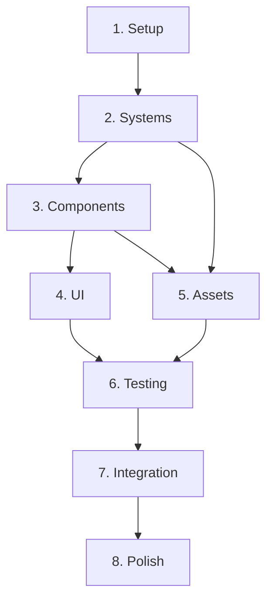

# Large Spec Task Organization

## When to Use Nested Tasks

For specs with more than 50 tasks or 5+ major sections, split tasks into:
- `tasks.md` - Table of Contents with links to nested files
- `tasks/` directory containing individual task files per major section

## Directory Structure

```
.kiro/specs/{feature-name}/
├── requirements.md
├── design.md
├── tasks.md              # TOC with overview and links
└── tasks/
    ├── 01-setup.md
    ├── 02-systems.md
    ├── 03-components.md
    ├── 04-ui.md
    ├── 05-assets.md
    ├── 06-testing.md
    ├── 07-integration.md
    └── 08-polish.md
```

## TOC Format (tasks.md)

```markdown
# Implementation Tasks: {Feature Name}

## Overview
{Brief description of implementation approach}

## Version Requirements
- Node.js: >=22.22.0
- PNPM: >=10.0.0
- TypeScript: 5.9+
- React: 19
- Three.js: 0.182

## Task Sections

| Section | File | Tasks | Status |
|---------|------|-------|--------|
| 1. Setup | [01-setup.md](tasks/01-setup.md) | 8 | Not Started |
| 2. Systems | [02-systems.md](tasks/02-systems.md) | 12 | Not Started |
| 3. Components | [03-components.md](tasks/03-components.md) | 15 | Not Started |
| 4. UI | [04-ui.md](tasks/04-ui.md) | 10 | Not Started |
| 5. Assets | [05-assets.md](tasks/05-assets.md) | 8 | Not Started |
| 6. Testing | [06-testing.md](tasks/06-testing.md) | 12 | Not Started |
| 7. Integration | [07-integration.md](tasks/07-integration.md) | 6 | Not Started |
| 8. Polish | [08-polish.md](tasks/08-polish.md) | 5 | Not Started |

**Total Tasks:** 76

## Dependency Graph



## Execution Notes

- Execute sections sequentially (1 → 2 → 3 → ...)
- Some tasks within sections can be parallelized
- Commit after each task or logical group
- Push after each section completes
- Run `pnpm check` before committing
- Run `pnpm test` after implementing features
```

## Nested Task File Format

Each nested file follows this structure:

```markdown
# {Section Number}. {Section Title}

**Parent:** [tasks.md](../tasks.md)
**Validates:** Requirements X, Y, Z

## Overview
{What this section accomplishes}

## Prerequisites
- {Prerequisite 1}
- {Prerequisite 2}

## Tasks

### {N}.1. {Subsection Title}

**Validates:** Requirement X.Y

- [ ] {N}.1.1. {Task description}
  - {Additional detail}
  - {File to modify: `path/to/file.ts`}
  
- [ ] {N}.1.2. {Task description}
  - {Additional detail}
  - {Command to run: `pnpm test`}

### {N}.2. {Subsection Title}

**Validates:** Requirement X.Z

- [ ] {N}.2.1. {Task description}
- [ ] {N}.2.2. {Task description}

## Verification

After completing this section:
- [ ] All TypeScript compiles without errors
- [ ] All tests pass
- [ ] Linting passes (`pnpm check`)
- [ ] No console errors in dev mode
- [ ] Performance targets met

## Common Commands

```bash
# Development
pnpm --filter @neo-tokyo/game dev

# Build
pnpm --filter @neo-tokyo/game build

# Test
pnpm --filter @neo-tokyo/game test

# Lint
pnpm --filter @neo-tokyo/game check
```
```

## Task Numbering Convention

- Use `{section}.{subsection}.{task}` format (e.g., 1.3.2)
- Section numbers match file prefix (01 = section 1)
- Subsections are logical groupings within a section
- Tasks are atomic, executable units

Example:
- `1.3.2` = Section 1, Subsection 3, Task 2
- File: `tasks/01-setup.md`
- Subsection: "1.3. Configure TypeScript"
- Task: "1.3.2. Set up path aliases"

## Status Tracking

Use these markers in the TOC:

- `Not Started` - No tasks begun
- `In Progress` - Some tasks complete
- `Blocked` - Waiting on dependency
- `Complete` - All tasks done

Update status after each section completes:

```bash
# Update tasks.md TOC
# Change "Not Started" to "Complete" for completed section
git add .kiro/specs/{spec-name}/tasks.md
git commit -m "feat({spec}): complete section N"
```

## Neo-Tokyo Specific Sections

### Typical Section Breakdown

1. **Setup** - Environment, dependencies, configuration
2. **Systems** - ECS systems (Physics, Combat, AI, etc.)
3. **Components** - React 3D components (Character, Enemy, etc.)
4. **UI** - HUD, menus, overlays
5. **Assets** - 3D models, animations, textures
6. **Testing** - Unit tests, E2E tests, property tests
7. **Integration** - Wire systems together, game loop
8. **Polish** - Performance optimization, visual polish

### System-Specific Sections

For combat system spec:
1. **Combat Logic** - Damage calculations, formulas
2. **Combat System** - ECS system implementation
3. **Combat Components** - React components for combat
4. **Combat UI** - Damage numbers, health bars
5. **Combat Assets** - Hit effects, animations
6. **Combat Testing** - Unit tests, integration tests

### Asset-Specific Sections

For character asset spec:
1. **Character Models** - 3D model integration
2. **Character Animations** - Animation system
3. **Character Materials** - Cel-shaded materials
4. **Character Manifests** - Metadata files
5. **Character Testing** - Asset loading tests

## Autonomous Execution with Large Specs

When executing large specs autonomously:

1. **Read TOC first** - Understand overall structure
2. **Execute section by section** - Complete one section before moving to next
3. **Update TOC status** - Mark sections complete as you go
4. **Commit per section** - Push after each section completes
5. **Trigger CodeRabbit** - Request review after each section
6. **Continue immediately** - Don't wait for review, keep executing

### Section Completion Checklist

After each section:
- [ ] All tasks in section complete
- [ ] All tests pass
- [ ] Linting passes
- [ ] TOC status updated
- [ ] Committed and pushed
- [ ] CodeRabbit review triggered
- [ ] GitHub issue updated

Then immediately start next section.

## Performance Considerations

For large specs with many tasks:

- **Batch commits**: Group related tasks into single commit
- **Incremental testing**: Test after each subsection, not just at end
- **Parallel work**: Some subsections can be done in parallel
- **Early integration**: Integrate early and often to catch issues
- **Continuous deployment**: Push frequently to keep PR manageable

## Example: Babylon.js Migration Spec

```
.kiro/specs/babylon-migration/
├── requirements.md
├── design.md
├── tasks.md
└── tasks/
    ├── 01-setup.md           # Babylon.js setup, Reactylon
    ├── 02-scene-migration.md # Convert Three.js scenes
    ├── 03-materials.md       # Cel-shaded materials
    ├── 04-physics.md         # Physics integration
    ├── 05-animations.md      # Animation system
    ├── 06-lighting.md        # Lighting setup
    ├── 07-testing.md         # Migration testing
    └── 08-cleanup.md         # Remove Three.js dependencies
```

Each file contains 5-15 tasks, totaling ~80 tasks for the entire migration.
