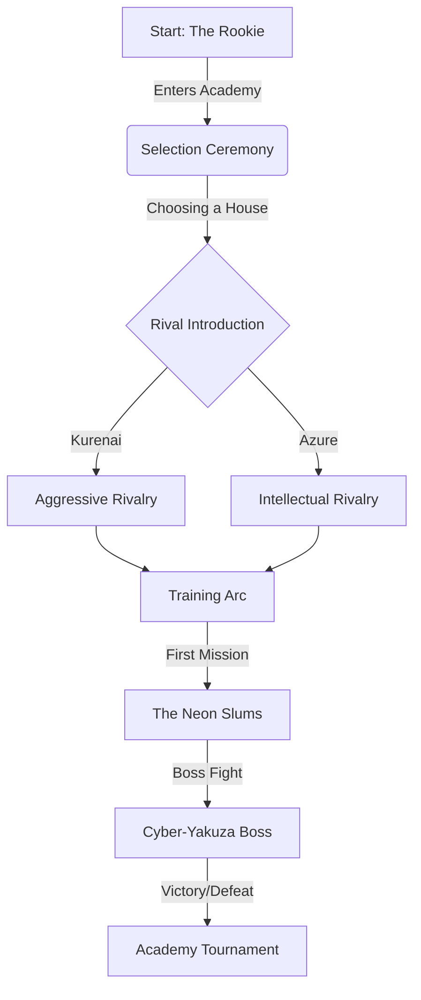

# Neo-Tokyo: Rival Academies - Master Design Plan

## 1. Vision Statement
A high-fidelity 3D Action-JRPG set in a cyberpunk Neo-Tokyo. The game combines the narrative depth of Persona with the kinetic platforming of Prince of Persia, rendered in a beautiful **Isometric Diorama** or **Cinematic Side-Scroll** style (TBD via prototype).

**Core Pillars:**
*   **Production Quality:** No placeholders. High-quality GLB assets, rigorous animations, and polished UI.
*   **GenAI Pipeline:** A sophisticated automated pipeline that transforms narrative concepts into rigged, animated 3D assets using **Meshy AI** (Text-to-Image -> Image-to-3D -> Rig -> Animate).
*   **Deep Narrative:** A complex rivalry system driven by LLM agents, with emotional beats and branching dialogue.
*   **Kinetic Gameplay:** Fluid movement (Parkour, Wall-runs) and combat.

## 2. The GenAI Asset Pipeline (Automated Content Factory)

We have moved away from runtime procedural generation to a **Build-Time Content Factory**.

### Architecture
*   **Source of Truth:** `packages/game/src/content/manifest.json`. Defines all characters and backgrounds.
*   **Orchestrator:** `ModelerAgent` (`packages/content-gen/src/agents/ModelerAgent.ts`).
*   **Technology:** Meshy AI API.

### Workflow (The "Happy Path")
1.  **Concept Art (Text-to-Image):**
    *   **Endpoint:** `POST /v1/text-to-image`
    *   **Model:** `nano-banana-pro`
    *   **Prompting:** Enforces `t-pose`, `white background`, `neutral lighting`.
2.  **3D Modeling (Image-to-3D):**
    *   **Endpoint:** `POST /v1/image-to-3d`
    *   **Model:** `latest` (Meshy-6)
    *   **Settings:** `pose_mode: "t-pose"`, `topology: "quad"`, `target_polycount: 50000`, `enable_pbr: true`.
3.  **Auto-Rigging:**
    *   **Endpoint:** `POST /v1/rigging`
4.  **Animation:**
    *   **Endpoint:** `POST /v1/animations`
    *   **Library:** Mapped via `ANIMATION_IDS` (e.g., `IDLE_COMBAT: 89`).

## 3. Prototype Strategy (The "Dual Prototype")

To determine the final camera and gameplay perspective, we have implemented two concurrent prototypes in the main application.

### A. Isometric Diorama Scene
*   **Goal:** Test spatial exploration and tactical combat feel.
*   **Camera:** Orthographic, fixed angle (Diablo/Hades style).
*   **Controls:** Click-to-move or WASD relative to screen.
*   **Strengths:** Visual density, "toy box" appeal.

### B. Cinematic Side-Scroll Scene
*   **Goal:** Test verticality, parkour mechanics, and "Prince of Persia" flow.
*   **Camera:** Perspective, side view with parallax depth.
*   **Controls:** Left/Right movement, Jump, Climb.
*   **Strengths:** Kinetic movement, cinematic framing.

**Access:** Toggle between modes using the UI buttons in the dev build (`pnpm dev`).

## 4. Player Journey (The "Why")

## 5. Technical Architecture

### Frontend (Game Client)
*   **Engine:** Three.js + React Three Fiber (R3F).
*   **State:** Miniplex (ECS) + Zustand.
*   **Physics:** Rapier (via React-Three-Rapier).
*   **UI:** HTML/CSS overlays (React).

### Backend (Content Gen)
*   **Language:** TypeScript (Node.js).
*   **CLI:** `pnpm generate` (Manifest-driven).
*   **Persistence:** JSON Manifests + Git LFS (for binary assets).

---
*Last Updated: 2026-01-15*