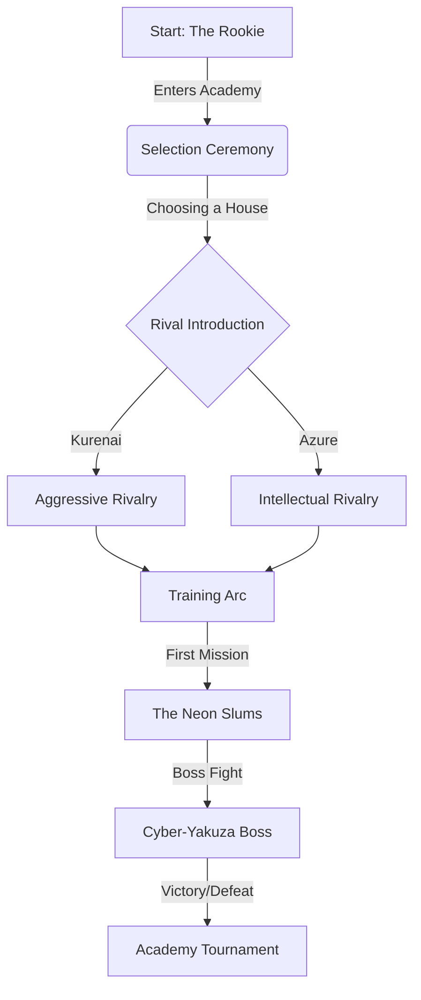
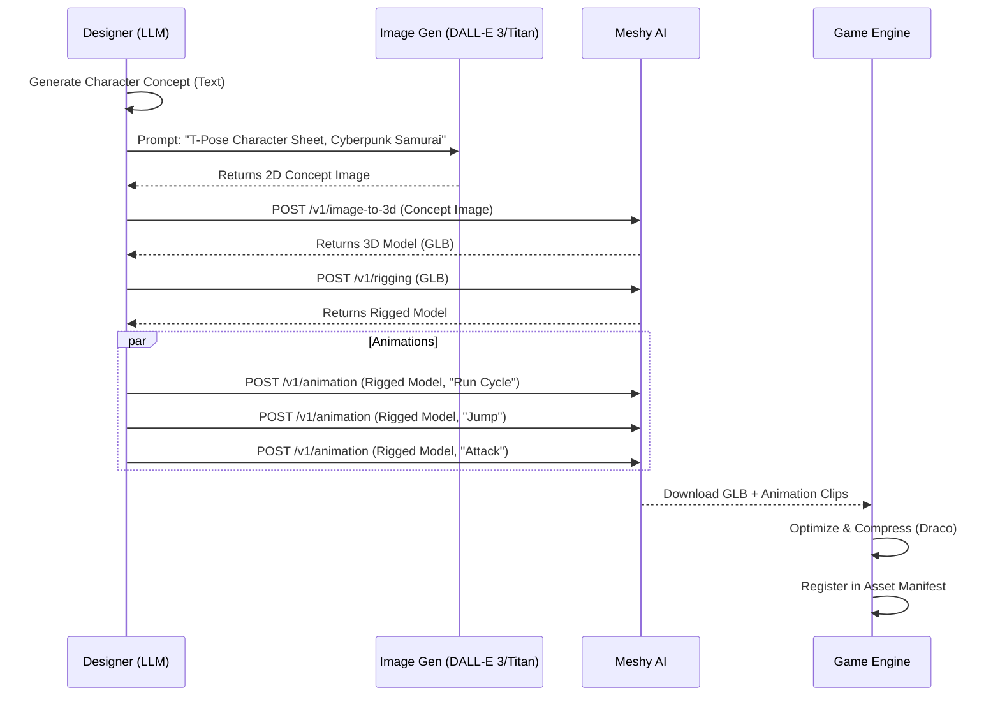

# Neo-Tokyo: Rival Academies - Master Design Plan

## 1. Vision Statement
A high-fidelity 3D Action-JRPG set in a cyberpunk Neo-Tokyo. The game combines the narrative depth of Persona with the kinetic platforming of Prince of Persia, rendered in a beautiful isometric diorama style.

**Core Pillars:**
*   **Production Quality:** No placeholders. High-quality GLB assets, rigorous animations, and polished UI.
*   **GenAI Pipeline:** A sophisticated automated pipeline that transforms narrative concepts into rigged, animated 3D assets.
*   **Deep Narrative:** A complex rivalry system driven by LLM agents, with emotional beats and branching dialogue.
*   **Kinetic Gameplay:** Fluid movement (Parkour, Wall-runs) and combat.

## 2. Player Journey (The "Why")



## 3. UX & UI Flow (The "How")

### HUD Layout (Mockup)
```
+---------------------------------------------------------------+
|  [HP: 100/100]  [MP: 50/50]                    [MINIMAP]      |
|                                                               |
|                                                               |
|                        (Game View)                            |
|                                                               |
|                                                               |
|  [Character Portrait]                          [Skill Bar]    |
|  "Dialogue Overlay..."                         [Q][W][E][R]   |
+---------------------------------------------------------------+
```

### Menu Hierarchy
1.  **Title Screen**: Animated 3D Cityscape Background.
2.  **Academy Hub**: 3D explorable space (Diorama).
    *   Dorm (Save/Rest)
    *   Dojo (Skill Tree)
    *   Mission Terminal (Quest Select)
3.  **Pause Menu**: Inventory, Stats, Settings.

## 4. The GenAI Asset Pipeline

We are moving away from runtime procedural generation to a **Build-Time Content Factory**.



## 5. Technical Architecture

### Frontend (Game Client)
*   **Engine**: Three.js + React Three Fiber (R3F).
*   **State**: Miniplex (ECS) + Zustand.
*   **Physics**: Rapier (via React-Three-Rapier) or Canon.
*   **UI**: HTML/CSS overlays (React). 21st.dev components for complex widgets.

### Backend (Content Factory)
*   **Orchestrator**: Node.js scripts in `packages/content-gen`.
*   **Agents**:
    *   `NarrativeAgent`: Writes the story/quests.
    *   `ArtDirectorAgent`: Generates visual prompts.
    *   `ModelerAgent`: Interfaces with Meshy API.
*   **Asset Store**: Git LFS or Cloud Storage (S3/R2) for large GLBs.

## 6. Immediate Roadmap

### Phase 1: The Pipeline (Days 1-2)
1.  Implement `MeshyClient` in `packages/content-gen`.
2.  Create `ModelerAgent` to automate `Text -> Image -> 3D -> Rig -> Anim`.
3.  Test pipeline with "Main Character" generation.

### Phase 2: The Foundation (Days 3-4)
1.  Replace `Player` box with `Character.glb` (animated).
2.  Implement `AnimationController` in R3F (blending states).
3.  Build "Academy Hub" diorama using generated assets.

### Phase 3: The Polish (Days 5-7)
1.  Implement "Prince of Persia" camera system (Cinematic side-scroll/iso hybrid).
2.  Add Post-processing (Bloom, Color Grading).
3.  Finalize HUD with 21st.dev components.

## 7. Emotional & Narrative Beats
*   **The Rivalry**: The Rival is not just a boss; they are a persistent shadow. They grow as you grow.
*   **The City**: Neo-Tokyo should feel oppressive yet alluring. Neon rain, steam vents, holographic ads.
*   **The Music**: Adaptive synthwave that intensifies during combat.

---
*Generated by Gemini CLI - 2026-01-15*
