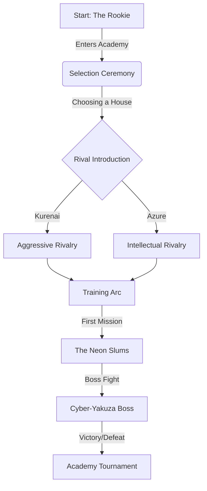

# Neo-Tokyo: Rival Academies - Master Design Plan

> **Updated**: January 27, 2026 | **Platform**: Ionic Angular + Babylon.js

## 1. Vision Statement
A high-fidelity 3D Action-JRPG set in a flooded Neo-Tokyo. The game combines the narrative depth of Persona with kinetic combat and exploration, rendered in a beautiful **Isometric** style with Babylon.js toon materials.

**Core Pillars:**
*   **Production Quality:** No placeholders. High-quality GLB assets, rigorous animations, and polished UI.
*   **GenAI Pipeline:** A sophisticated automated pipeline that transforms narrative concepts into rigged, animated 3D assets using **Meshy AI** (Text-to-Image -> Image-to-3D -> Rig -> Animate).
*   **Deep Narrative:** A complex rivalry system driven by LLM agents, with emotional beats and branching dialogue.
*   **Kinetic Gameplay:** Fluid movement (Parkour, Wall-runs) and combat.

## 2. The GenAI Asset Pipeline (Automated Content Factory)

We use a **Build-Time Content Factory** with declarative JSON pipelines.

### Architecture
*   **Source of Truth:** Per-asset `manifest.json` files in `src/assets/`
*   **Orchestrator:** `PipelineExecutor` with JSON pipeline definitions
*   **Technology:** Meshy AI API

### Pipeline Types
| Pipeline | Description | Steps |
|----------|-------------|-------|
| `character` | Full humanoid characters | concept → model → rigging → animations |
| `prop` | Non-humanoid props/hazards | concept → model |
| `tile` | Hex tile assets | concept → model |
| `background` | 2D scene backgrounds | concept only |

### Animation Presets
| Preset | Description | Animation Count |
|--------|-------------|-----------------|
| `hero` | Playable characters | 7 animations |
| `enemy` | Standard enemies | 5 animations |
| `boss` | Boss characters | 7 animations |
| `prop` | Animated props | 1 animation |

See [/docs/pipeline/GENAI_PIPELINE.md](/docs/pipeline/GENAI_PIPELINE.md) for full technical details.

## 3. Prototype Strategy (The "Dual Prototype")

To determine the final camera and gameplay perspective, we have implemented two concurrent prototypes in the main application.

### A. Isometric Diorama Scene
*   **Goal:** Test spatial exploration and tactical combat feel.
*   **Camera:** Orthographic, fixed angle (Diablo/Hades style).
*   **Controls:** Click-to-move or WASD relative to screen.
*   **Strengths:** Visual density, "toy box" appeal.

### B. Cinematic Side-Scroll Scene
*   **Goal:** Test verticality, parkour mechanics, and "Prince of Persia" flow.
*   **Camera:** Perspective, side view with parallax depth.
*   **Controls:** Left/Right movement, Jump, Climb.
*   **Strengths:** Kinetic movement, cinematic framing.

**Access:** Toggle between modes using the UI buttons in the dev build (`pnpm dev`).

## 4. Player Journey (The "Why")

## 5. Technical Architecture

### Frontend (Game Client)
*   **Engine:** Babylon.js (imperative runtime).
*   **State:** Miniplex (ECS) + Zustand.
*   **Physics:** Rapier (via Babylon.js integration).
*   **UI:** Ionic + Angular overlays.

### Backend (Content Gen)
*   **Language:** TypeScript (Node.js).
*   **CLI:** `pnpm generate` (Manifest-driven).
*   **Persistence:** JSON Manifests + Git LFS (for binary assets).

### Generated Characters (v1.0)
*   **Main:** Kai (hero), Vera (hero)
*   **B-Story:** Yakuza Grunt/Boss, Biker Grunt/Boss
*   **C-Story:** Mall Security Guard, Alien Humanoid, Tentacle (prop)

---

*Last Updated: 2026-01-15*
